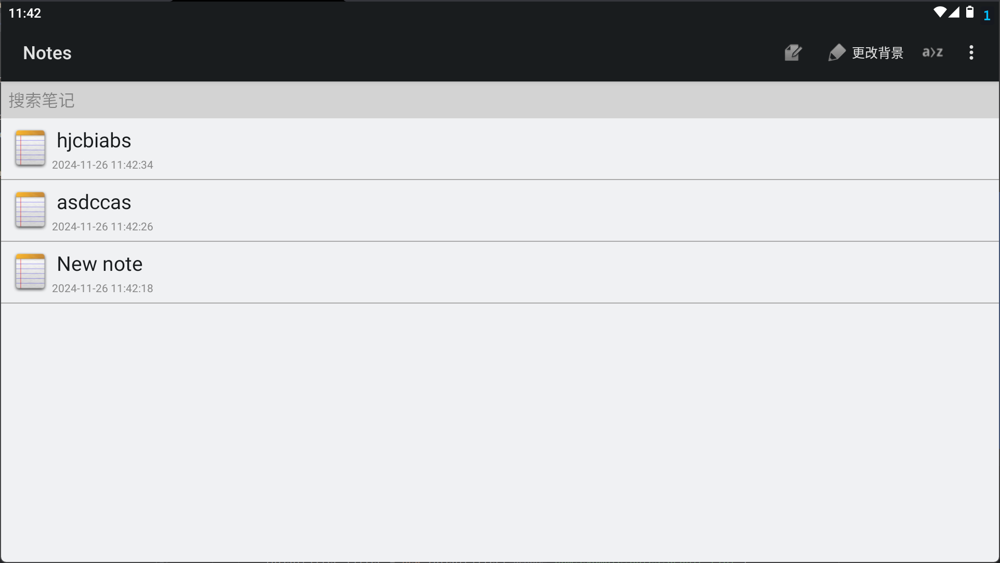
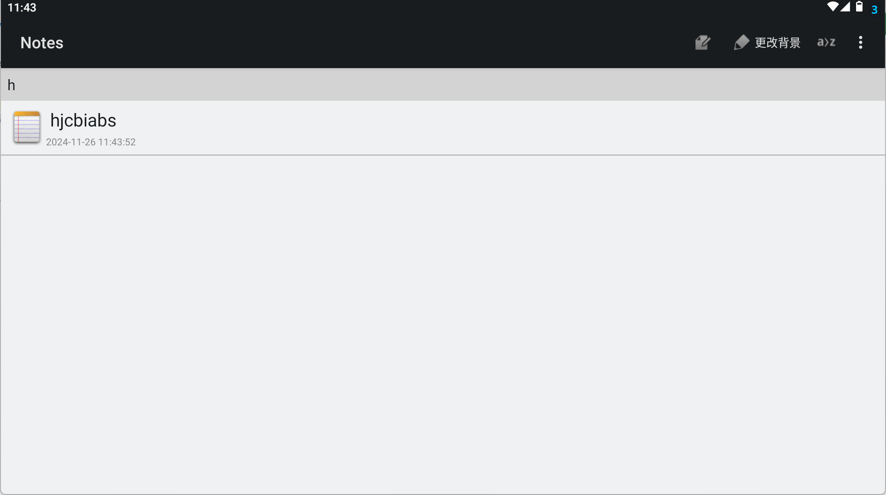
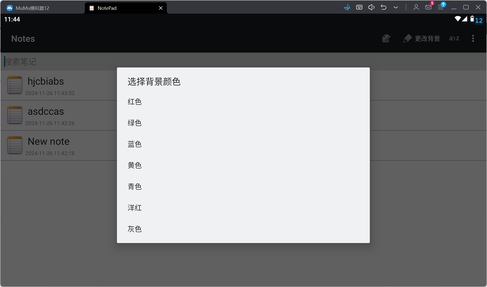
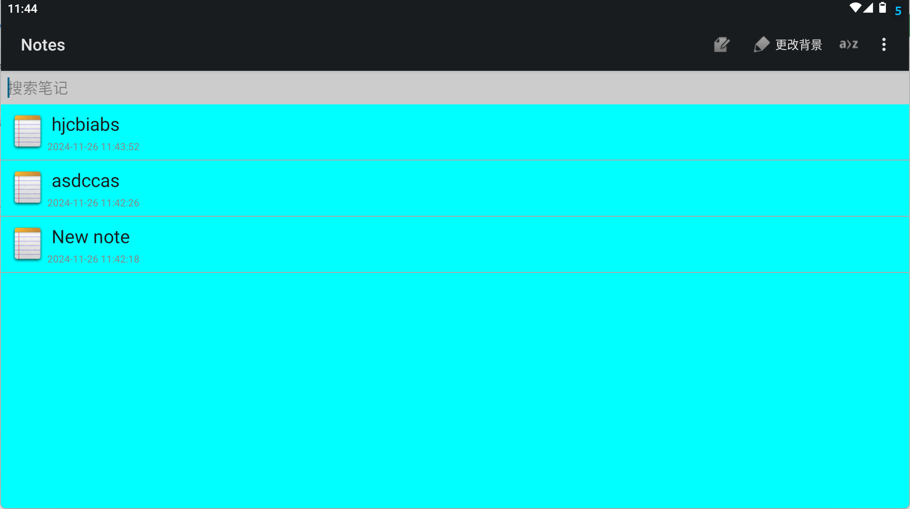
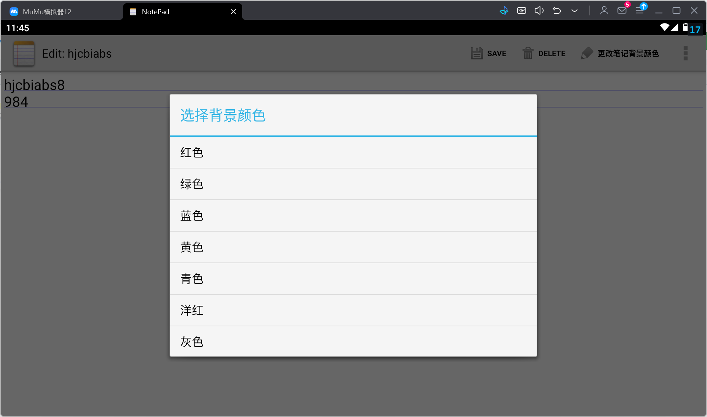
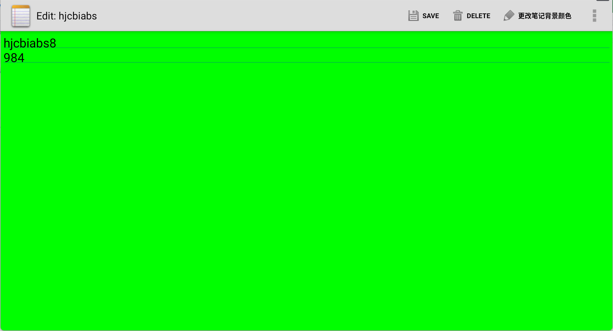
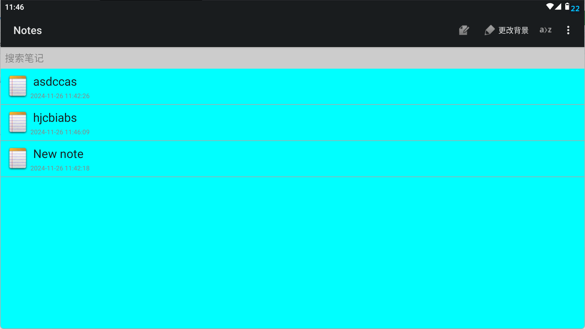

# **NotePad 应用**

## 一、基本功能
- **NoteList界面中笔记条目增加时间戳显示**
- **添加笔记查询功能**（根据标题或内容查询）

## 扩展功能
- **更改记事本背景(主页和背景)**
- **按照笔记标题排序**
- **笔记左侧显示图片(美化)**

---

## 二、功能介绍

### 1. 笔记管理
- **新增笔记**：创建新的笔记，内容为空。
- **编辑笔记**：支持对已保存的笔记进行编辑。
- **删除笔记**：删除当前笔记。
- **取消更改**：编辑过程中可以取消更改，恢复到原始状态。
- **排序笔记**：点击排序按钮按标题对笔记进行升序或降序排序。

### 2. 笔记个性化设置
- **背景颜色设置**：用户可以为笔记设置背景颜色。
  支持 7 种颜色选择（红色、绿色、蓝色、黄色、青色、洋红、灰色）。
  设置的背景颜色会被保存并在下次打开时恢复。

### 3. 广播机制
- **实时更新**：每当笔记被保存或删除时，会发送广播通知其他组件，便于刷新笔记列表。

### 4. 搜索笔记
- 在搜索框中输入关键词，应用会根据标题内容实时过滤笔记，展示符合条件的笔记项。

---

## 三、基本功能展示

### • **NoteList界面中笔记条目增加时间戳显示**


### • **添加笔记查询功能（根据标题或内容查询）**


---

## 四、扩展功能展示

### • **更改记事本背景**

#### 1. 修改主页背景



#### 2. 修改笔记内部背景



### • **按照笔记标题排序**


### • **笔记左侧显示图片**


---

## 五、功能实现

### **1.显示时间戳**
#### 在Oncreate()方法中
```java
Cursor cursor = managedQuery(
            getIntent().getData(),            
            PROJECTION,                       
            null,                             
            null,                             
            NotePad.Notes.DEFAULT_SORT_ORDER  
        );

        String[] dataColumns = { NotePad.Notes.COLUMN_NAME_TITLE, NotePad.Notes.COLUMN_NAME_MODIFICATION_DATE } ;

        int[] viewIDs = { android.R.id.text1, R.id.timestamp };

        SimpleCursorAdapter adapter
            = new SimpleCursorAdapter(
                      this,                            
                      R.layout.noteslist_item,          
                      cursor,                           
                      dataColumns,
                      viewIDs
              );

        setListAdapter(adapter);
```

### **2.背景颜色设置，使用 SharedPreferences 实现背景颜色的保存和恢复**

#### 保存背景颜色：
```java
private void saveBackgroundColor(int color) {
    SharedPreferences preferences = getSharedPreferences("NoteSettings", MODE_PRIVATE);
    SharedPreferences.Editor editor = preferences.edit();
    editor.putInt("backgroundColor", color);
    editor.apply();
}
```
#### 恢复背景颜色：
```java
private void restoreBackgroundColor() {
    SharedPreferences preferences = getSharedPreferences("NoteSettings", MODE_PRIVATE);
    int defaultColor = Color.WHITE;
    int color = preferences.getInt("backgroundColor", defaultColor);
    getWindow().getDecorView().setBackgroundColor(color);
}
```
### **3.广播机制**
#### 发送广播：在笔记保存、删除或取消时发送自定义广播，通知列表更新：
```java
Intent intent = new Intent("com.example.notes.UPDATE_LIST");
sendBroadcast(intent);
```
### **4.搜索实现**
搜索框的实现主要通过对 ListView 的数据进行过滤来完成。ListView 中的适配器会根据用户输入的关键词，动态过滤出符合条件的笔记项。
#### 在 onCreate() 方法中设置监听器：
```java
EditText searchBox = findViewById(R.id.search_box);
searchBox.addTextChangedListener(new TextWatcher() {
    @Override
    public void beforeTextChanged(CharSequence charSequence, int start, int count, int after) {
        // 可选: 在文本改变前执行的操作
    }

    @Override
    public void onTextChanged(CharSequence charSequence, int start, int before, int after) {
        // 过滤 ListView 中的笔记
        filterNotes(charSequence.toString());
    }

    @Override
    public void afterTextChanged(Editable editable) {
        // 可选: 文本改变后执行的操作
    }
});
```
#### 过滤笔记方法：
```java
private void filterNotes(String query) {
    Cursor cursor = getContentResolver().query(
        NoteProvider.CONTENT_URI, 
        null,
        "title LIKE ?",
        new String[]{"%" + query + "%"},
        null
    );
    adapter.changeCursor(cursor);  // 更新 ListView 的适配器数据
}
```
### **5排序笔记**

笔记可以通过标题进行排序。点击菜单项 **排序** 按钮后，笔记会按照升序或降序排列。排序的实现依赖于 `Cursor` 查询的排序条件。
#### 排序方法
```java
private void cycleSortOrder() {
        switch (currentSortState) {
            case SORT_DEFAULT:
                // 切换到按传统标题排序
                currentSortState = SORT_BY_TRADITIONAL_TITLE;
                updateNotesList(
                        "CASE " +
                                "WHEN " + NotePad.Notes.COLUMN_NAME_TITLE + " GLOB '[0-9]*' THEN 1 " + // 数字或标点符号
                                "WHEN " + NotePad.Notes.COLUMN_NAME_TITLE + " GLOB '[A-Za-z]*' THEN 2 " + // 字母
                                "ELSE 3 END, " +
                                NotePad.Notes.COLUMN_NAME_TITLE + " COLLATE LOCALIZED ASC"
                );
                break;

            case SORT_BY_TRADITIONAL_TITLE:
                // 切换回默认排序
                currentSortState = SORT_DEFAULT;
                updateNotesList(NotePad.Notes.DEFAULT_SORT_ORDER);
                break;
        }
    }
```
